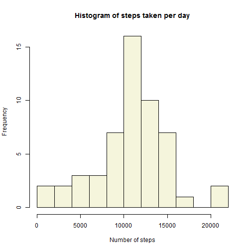
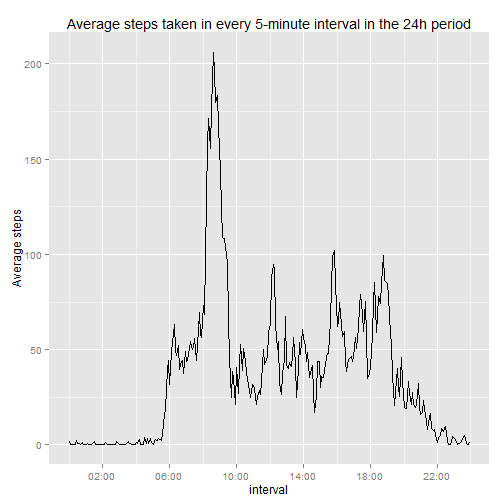
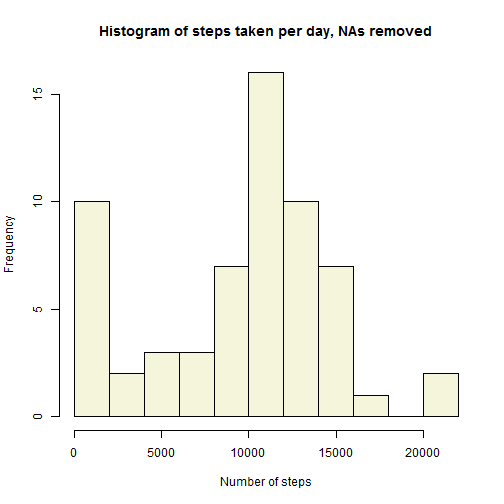
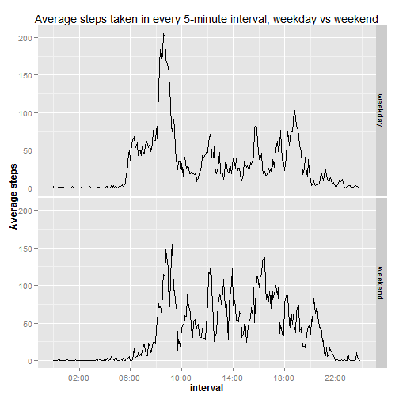

## Loading and preprocessing the data  

First, we will read in and preprocess data supplied in "activity.csv" file. The dataset contains data from a personal activity monitoring device. This device collects data at 5 minute intervals through out the day. The data consists of two months of data from an anonymous individual collected during the months of October and November, 2012 and include the number of steps taken in 5 minute intervals each day.

The following variables are included in the dataset:  
- steps (integer; number of steps in a given 5-minute interval, where missing values have been given as NA)  
- date (character; the date on which the reading was taken)  
- interval (character; identifier for each 5-minute time interval in the 24-hour period)  

Date variable needs to be converted to a date using as.Date function.  
Interval variable needs to be converted to a POSIXct format for easier plotting. As the intervals are in hhmm format, with no leading zeroes, the interval was first converted to a uniform 4-character form using the sprintf function. Then, hours and minutes were split off and as.POSIXct formula was used to create a new variable combining date and time, integer2.  

It is assumed the csv file is in the working directory.


```r
data <- read.csv("activity.csv")
data$date <- as.Date(data$date)
data$interval <- sprintf("%04d", data$interval)
hours <- substr(data$interval,1,2)
minutes <- substr(data$interval,3,4)
data$interval2 <- as.POSIXct(paste(data$date," ",hours,":",minutes, sep=""))
rm(hours)
rm(minutes)
```

## What is mean total number of steps taken per day?  
### Make a histogram of the total number of steps taken each day  
In order to make a histogram, we need to sum the steps for each day. We first make a temporary vector to hold the daily totals and then plot the histogram using the base package with bins set to 10.  

```r
temp <-tapply(data$steps, data$date, sum)
hist(temp, breaks=10, col="beige",main="Histogram of steps taken per day", xlab="Number of steps")
```

 

### Calculate and report the **mean** and **median** total number of steps taken per day  
We also calculate the mean and the median of the daily steps, ignoring for the missing values.  

```r
mean(temp, na.rm=TRUE)
```

```
## [1] 10766.19
```

```r
median(temp, na.rm=TRUE)
```

```
## [1] 10765
```

```r
rm(temp)
```

## What is the average daily activity pattern?
### Make a time series plot of the 5-minute interval (x-axis) and the average number of steps taken, averaged across all days (y-axis)  

For this part of the assignment, we used ggplot2, so ggplot2 and scales libraries need to be loaded. First, a temporary data frame is prepared to hold the 5-minute averages across days. Average daily steps have been calculateby by applying the average function across every 5-minute interval, ignoring missing values. Then, a time series plot is prepared, with time from 00:00 to 23:55 on the x-axis and average steps on the y-axis.  

```r
library(ggplot2)
library(scales)
xx <- data.frame(interval=data$interval2[1:288], ave_steps=0)
xx$ave_steps <- tapply(data$steps, data$interval,mean, na.rm=TRUE)
g <- ggplot(xx, aes(x=interval,y=ave_steps))
g + scale_x_datetime(labels = date_format("%H:%M"),breaks = "4 hour") + geom_line() +labs(title="Average steps taken in every 5-minute interval in the 24h period") + ylab("Average steps")
```

 

### Which 5-minute interval, on average across all the days in the dataset, contains the maximum number of steps?  

This question is solved by finding the maximum value of ave_steps variable in the temporary data frame.

```r
strftime(xx$interval[which(max(xx$ave_steps)==xx$ave_steps)], format="%H:%M")
```

```
## [1] "08:35"
```

```r
rm(xx)
rm(g)
```

## Imputing missing values  
### Calculate and report the total number of missing values in the dataset (i.e. the total number of rows with NAs)  

```r
missing <- sum(is.na(data$steps))
not_missing <- sum(!is.na(data$steps))
missing_perc <- round(missing/(missing+not_missing)*100)
```
There are 2304 missing step count readings or 13% of total step count readings.  
### Create a new dataset that is equal to the original dataset but with the missing data filled in.  
In order to fill in the missing step counts, we decided to use the median of the available readings in the same time interval. First, a new data frame is created and missing values are replaced as previously explained.A temporary data frame has been created to hold the median steps for each 5-minute interval.  

```r
rm(missing, not_missing,missing_perc)
new_data <- data
xx <- data.frame(interval=new_data$interval[1:288], med_steps=0)
xx$med_steps <- tapply(new_data$steps, new_data$interval,median, na.rm=TRUE)
new_data$steps[is.na(new_data$steps) & new_data$interval==xx$interval] <- xx$med_steps
rm(xx)
```
### Make a histogram of the total number of steps taken each day and Calculate and report the mean and median total number of steps taken per day. Do these values differ from the estimates from the first part of the assignment? What is the impact of imputing missing data on the estimates of the total daily number of steps?  

```r
temp <-tapply(new_data$steps, new_data$date, sum)
hist(temp, breaks=10, col="beige",main="Histogram of steps taken per day, NAs removed", xlab="Number of steps")
```

 

```r
mean(temp)
```

```
## [1] 9503.869
```

```r
median(temp)
```

```
## [1] 10395
```

```r
rm(temp)
```
A histogram has been plotted useing the base package with 10 bins. The values differ from the estimates obtained in the first part of the assignment. Imputing missing data has reduced the mean by 1263 steps and the median by 370 steps. This was likely caused by the introduction of zero median values to many missing values.  


## Are there differences in activity patterns between weekdays and weekends?  
### Create a new factor variable in the dataset with two levels - "weekday" and "weekend" indicating whether a given date is a weekday or weekend day.  
A new factor is first introduced, differentiating between weekdays and weekends. Then, a temporary dataframe has been set up to transform the data set for easier plotting with the ggplot package.  

```r
new_data$workday <- factor(rep("weekday",dim(new_data)[1]),levels=c("weekday","weekend"))
new_data$workday[which(weekdays(new_data$date)=="Saturday")] <- "weekend"
new_data$workday[which(weekdays(new_data$date)=="Sunday")] <- "weekend"
weekdaytemp <- data.frame(interval=new_data$interval2[1:288], ave_steps=0,day="weekday")
weekdaytemp$ave_steps <- tapply(new_data$steps[new_data$workday=="weekday"], new_data$interval[new_data$workday=="weekday"],mean, na.rm=TRUE)
weekendtemp <- data.frame(interval=new_data$interval2[1:288], ave_steps=0,day="weekend")
weekendtemp$ave_steps <- tapply(new_data$steps[new_data$workday=="weekend"], new_data$interval[new_data$workday=="weekend"],mean, na.rm=TRUE)
xx <- rbind(weekdaytemp,weekendtemp)
```
### Make a panel plot containing a time series plot of the 5-minute interval (x-axis) and the average number of steps taken, averaged across all weekday days or weekend days (y-axis).  
Finally, a panel plot is created with ggplot.  

```r
g <- ggplot(xx, aes(x=interval,y=ave_steps))
g + scale_x_datetime(labels = date_format("%H:%M"),breaks = "4 hour") + geom_line() + facet_grid(day~.) +labs(title="Average steps taken in every 5-minute interval, weekday vs weekend")+theme(axis.title=element_text(size=12,face="bold"),axis.text=element_text(size=10)) + ylab("Average steps")
```

 
